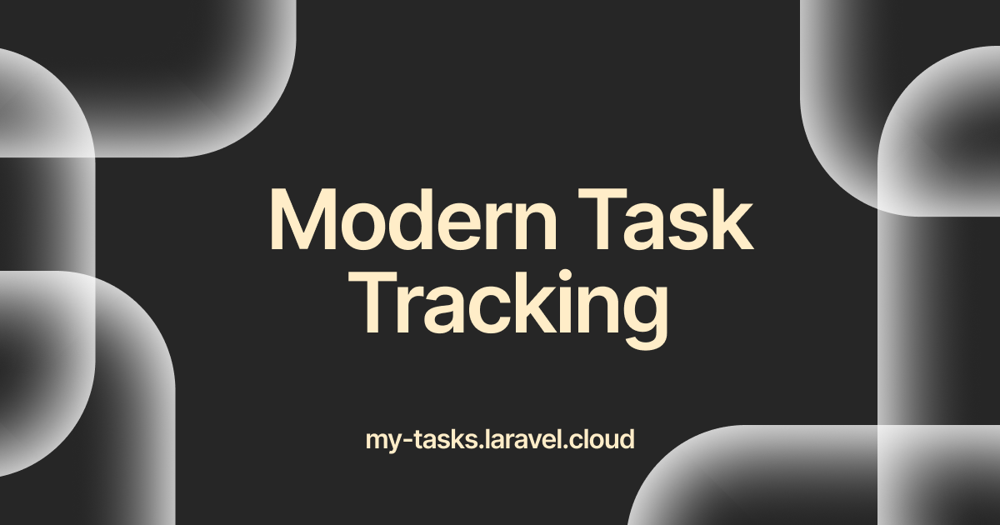

# MyTasks

<p align="center">
	
</p>

<p align="center">
	A productivity-focused task manager with GTD workflows, time blocking, and analytics — built with Laravel & Livewire.
</p>

---

> [!WARNING]
> **Heavy Development in Progress**
>
> This repository is under active development and is not currently
> suitable for any kind of production or real-world usage. The database
> schema, APIs, and features change frequently; your data may be lost at
> any time. Only run this project if you understand it is _very_ early
> and you are prepared to rebuild from scratch when the next update
> lands.

## Table of Contents

- [Overview](#overview)
- [Features](#features)
- [Tech Stack](#tech-stack)
- [Requirements](#requirements)
- [Quick Start](#quick-start)
    - [Windows](#windows)
    - [Linux](#linux)
    - [macOS](#macos)
- [Running the App](#running-the-app)
- [Demo Data](#demo-data)
- [Authentication and Access](#authentication-and-access)
- [Project Structure](#project-structure)
- [Testing](#testing)

## Overview

MyTasks is a productivity-focused task management application. Beyond basic task CRUD, it incorporates GTD (Getting Things Done) workflows, time blocking, weekly reviews, mood logging, and analytics — giving you a comprehensive system for staying organized and motivated.

## Features

### Core Task Management

- **Tasks** — Full CRUD with statuses (pending, in progress, completed), priorities (low, medium, high, urgent), due dates, and estimated minutes.
- **Workspace Grouping** — Organize tasks into named workspaces by project or domain.
- **Schedule Status Tracking** — Each task automatically derives a schedule status (pending, missed, completed on time, completed late) from its due date and completion timestamp. `completed_at` is set/cleared automatically when status changes.
- **Due Tasks View** — A dedicated view surfacing overdue and upcoming tasks that need immediate attention, with sorting options.
- **Recurring Daily Tasks** — Mark tasks as recurring with configurable daily repetition counts.
- **Sorting & Filtering** — Tasks support 8 sort options (newest, oldest, title, due date, priority) and filtering by status, priority, workspace, and search keyword. Workspaces support sorting and task-presence filtering.

### GTD Workflows

- **Inbox (Quick Capture)** — Rapidly capture ideas into an inbox. Review and convert items into full tasks later, following the GTD "collect then process" methodology.
- **Someday/Maybe List** — Park tasks you might want to do eventually but aren't actionable now. Activate them into regular tasks when ready, with prefilled title and description.

### Time Blocking

- **Time Blocks** — Schedule blocks of time on specific dates with start and end times, optionally linked to a task. Supports a day-view calendar for daily planning.

### Analytics & Insights

- **Productivity Analytics** — View completion ratios and tasks completed per day (last 14 days).
- **Mood & Energy Logging** — Log your energy level (energized, neutral, drained) optionally tied to a task, with notes. View mood distribution charts and correlate well-being with productivity over time.
- **Weekly Reviews** — Record end-of-week summaries capturing tasks completed, missed, and created, plus freeform notes. Includes computed completion rate.

### Authentication & Security

- Authentication powered by Laravel Fortify (login, registration, email verification, password reset).
- Two-factor authentication (TOTP) support.
- Settings pages for profile management, appearance preferences, security (password change), and account deletion.

### UI

- Responsive UI using Livewire, Flux UI components, and Tailwind CSS.
- Sidebar navigation with links to all feature areas: Dashboard, Tasks, Due Tasks, Workspaces, Time Blocks, Inbox, Someday/Maybe, Analytics, Mood Tracker, and Weekly Reviews.

## Tech Stack

- Laravel 13
- Livewire 4 + Flux UI
- Tailwind CSS 4
- Laravel Fortify
- PHP 8.5

## Requirements

- PHP 8.5
- Composer (latest version recommended)
- Node.js and npm (Node.js 25 recommended)
- A Laravel-supported database (SQLite, MySQL, etc. SQLite is
  convenient for development)

## Quick Start

### Windows

```cmd
git clone https://github.com/user/my-tasks.git
cd my-tasks
composer install
npm install
copy .env.example .env
php artisan key:generate
npm run build
php artisan migrate
```

### Linux

```bash
git clone https://github.com/user/my-tasks.git
cd my-tasks
composer install
npm install
cp .env.example .env
php artisan key:generate
npm run build
php artisan migrate
```

### macOS

Steps are the same as Linux. If you're using Laravel Herd, the site will be served automatically after setup — see [Running the App](#running-the-app).

## Running the App

If you're on macOS or Windows and using Laravel Herd, the site will be
served automatically at the `.test` domain.

For manual development you can use:

```bash
composer run dev
```

This command starts the Laravel server, queue listener, and Vite dev
server together via `npx concurrently`.

## Demo Data

A user must exist in the database before seeding, as the seeders scan for existing users to associate data with.

```bash
php artisan db:seed
```

Seeders populate all feature tables:

| Seeder | Creates |
|---|---|
| `WorkspaceSeeder` | Sample workspaces |
| `TaskSeeder` | Tasks across priorities, statuses, and workspaces |
| `TimeBlockSeeder` | Time blocks linked to tasks |
| `InboxItemSeeder` | Unprocessed inbox items |
| `WeeklyReviewSeeder` | Weekly review entries |
| `MoodLogSeeder` | Mood/energy log entries |

**Test credentials:** `test@example.com` / password set by `UserFactory`.

## Authentication and Access

- You must be logged in to access the dashboard or any app screens.
- Fortify handles login, registration, password resets, email verification, and profile updates.
- Two-factor authentication (TOTP) is available in security settings.
- Settings pages cover profile editing, appearance preferences, security (password + 2FA), and account deletion.

## Project Structure

```
app/
├── Http/
│   ├── Controllers/      # 9 controllers (Task, Workspace, Inbox, Someday,
│   │                     #   TimeBlock, Analytics, WeeklyReview, MoodLog, DueTask)
│   └── Requests/         # 9 Form Request classes for validation
├── Livewire/
│   └── Actions/          # Logout action
├── Models/               # 7 Eloquent models
│   ├── User              # Accounts, 2FA, relationships to all features
│   ├── Task              # Core task with status/priority/schedule/recurring
│   ├── Workspace         # Project grouping for tasks
│   ├── InboxItem         # GTD quick-capture items
│   ├── TimeBlock         # Scheduled time blocks
│   ├── WeeklyReview      # End-of-week summaries
│   └── MoodLog           # Energy/mood tracking entries
└── Policies/             # 5 authorization policies
database/
├── factories/            # 7 model factories
├── migrations/           # 12 migrations
└── seeders/              # 7 seeders (one per feature)
resources/
└── views/                # 78 Blade templates
    ├── layouts/          # App + auth layouts with sidebar
    ├── pages/            # Settings & auth pages (Flux UI)
    └── tasks/ workspaces/ due-tasks/ inbox/ someday/
        time-blocks/ analytics/ weekly-reviews/ mood-logs/
routes/
├── web.php               # All feature routes (auth + verified middleware)
└── settings.php          # Profile, appearance, security routes
```

## Testing

Run the full test suite with:

```bash
php artisan test --compact
```

The project includes 21 test files covering all features: task CRUD, workspaces, due tasks, inbox, someday/maybe, time blocks, analytics, weekly reviews, mood logs, authentication, and settings.
